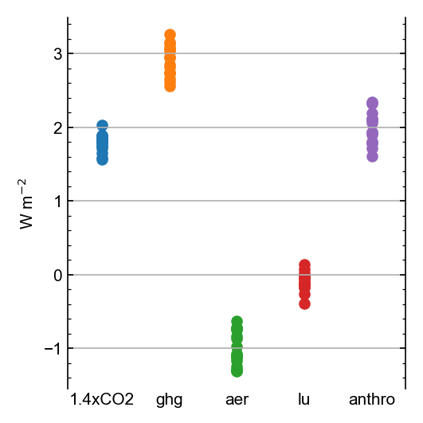

# rfmip-cmip6
Analysis of all RFMIP ERF tier 1 and tier 2 experiments submitted to CMIP6. Data and code in support of Kramer R., Smith C., and Andrews T., The Radiative Forcing Model Intercomparison Project (RFMIP2.0) for CMIP7, submitted to Geoscientific Model Development.

## to reproduce

```
git clone git@github.com:chrisroadmap/rfmip-cmip6.git
cd rfmip-cmip6
conda env create -f environment.yml
conda activate rfmip-cmip6
cd scripts
python process_timeslices.py
python process_transients.py
python analyse_timeslices.py
python analyse_transients.py 
```

## Tier 1 RFMIP experiments from CMIP6


## Tier 2 RFMIP experiments from CMIP6

